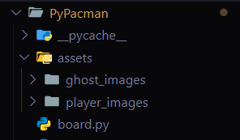
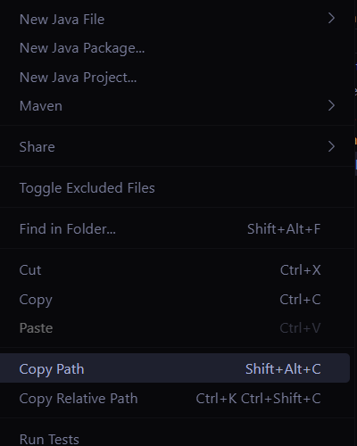

# Pacman hecho en Python

## Instalación del programa

1. Entra en el siguiente link: [https://github.com/MarlonUrda/Basic-Pacman.git](https://github.com/MarlonUrda/Basic-Pacman.git).
2. Presiona el botón que dice `<> Code` y seguidamente presiona la opción de `Download ZIP`.
3. Luego de haber descargado el .zip, descomprime el archivo en la carpeta que gustes.

## Ejecución del programa

Para poder jugar a Pacman hecho en Python, es de vital importancia asegurarse de tener instalado Python en tu equipo. Si no lo tienes, accede a este link para poder descargarlo: [https://www.python.org/](https://www.python.org/).

Antes de poder jugar Pacman, asegúrate de tener descargada la librería de `pygame`, ya que es necesaria para la ejecución de este juego. Si no la tienes descargada, en Visual Studio Code abre una terminal y ejecuta el siguiente comando:

```bash
pip install pygame
```
Luego en `pacman.py` busca las variables relative_player y relative_ghost, reemplaza el texto con la ruta de dichas carpetas en tu equipo. Esta ruta la obtienes de la siguiente manera:

- Ubica en tu proyecto la carpeta de `assets`.



- Luego presiona click derecho sobre la carpeta y dentro del menu selecciona la opcion de `Copy Path` (o `Copiar Ruta`).



Luego de haber instalado pygame ejecute el comando para entrar al juego:

```bash
python .\pacman.py
```